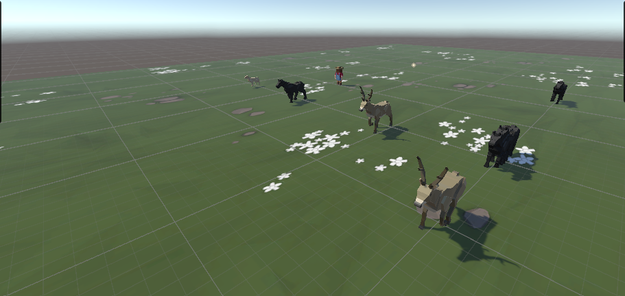

# Animal-Feeding-Phase-II

## Aim:
To develop a animal feeding game-Phase-2 using unity engine with C#.

## Algorithm:
### Random Animal Stampede
### Step 1: 
In the Hierarchy, create an Empty object called “SpawnManager”
### Step 2:
 Create a new script called “SpawnManager”, drag the script and attach it to the Spawn Manager in the hierarchy , and open it
### Step 3:
 Declare new public GameObject[ ] animalPrefabs;
### Step 4: 
In the inspector assign the size as 3 , for each element drag the animals from prefabs folder into the array

### Collision Decisions
### Step 1:
 Double-click on one of the animal prefabs, then Add Component > Box Collider
### Step 2: 
Click Edit Collider, then drag the collider handles to encompass the object
### Step 3: 
Check the “Is Trigger” checkbox
### Step 4:
 Repeat this process for each of the animals and the projectile
### Step 5: 
Add a RigidBody component to the (pizza)projectile and uncheck “use gravity”.
### Step 6: 
Create a new DetectCollisions.cs script, then drag the scripts and add it to each animal prefab and pizza, then open it and check it.
### Step 7: 
For all the animal prefabs and food in th inspector (below the  layer ) drop down the override option and choose apply all.

## Program:
#### Spawn Manager
```
using System.Collections;
using System.Collections.Generic;
using UnityEngine;

public class SpawnManager : MonoBehaviour
{
    public GameObject[] animalPrefabs;
    private float spawnRangeX = 20;
    private float spawnPosZ = 20;
    private float startDelay = 2;
    private float spawnInterval = 1.5f;

    // Start is called before the first frame update
    void Start()
    {
        InvokeRepeating("SpawnRandomAnimal", startDelay, spawnInterval);
    }

    // Update is called once per frame
    void Update()
    {


    }
    void SpawnRandomAnimal()
    {
        int animalIndex = Random.Range(0, animalPrefabs.Length);
        Vector3 spawnPos = new Vector3(Random.Range(-spawnRangeX, spawnRangeX), 0, spawnPosZ);
        Instantiate(animalPrefabs[animalIndex], spawnPos, animalPrefabs[animalIndex].transform.rotation);
    }
}


```
#### Detect Collider:
```
using System.Collections;
using System.Collections.Generic;
using UnityEngine;

public class DetectCollider : MonoBehaviour
{
    // Start is called before the first frame update
    void Start()
    {
        
    }

    // Update is called once per frame
    void Update()
    {
        
    }
    private void OnTriggerEnter(Collider other)
    {
        Destroy(gameObject);
        Destroy(other.gameObject);
    }
}


```
## Output:


## Result:
Thus,The Animal feeding game-Phase-2 using unity engine is developed successfully.


